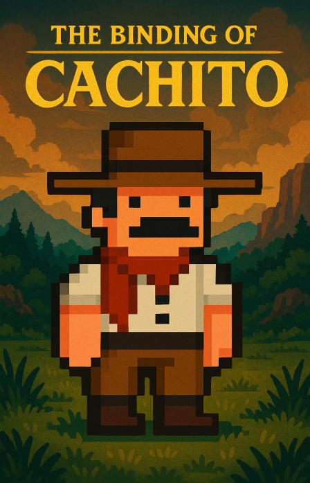
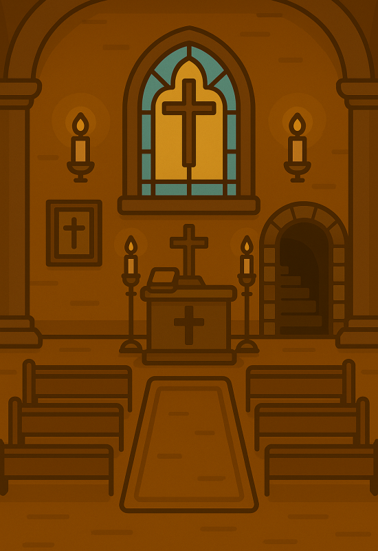

# The Bindig of Cachito

En el recóndito pueblo santiagueño de Tero Violado, donde la tierra roja cruje bajo los pies y las leyendas se filtran en la siesta, Cachito vive su vida tranquila junto a su prima–esposa, una macumbera experta en hechicería ancestral. Pero todo se desmorona cuando un ritual de invocación al escurridizo Pomberito sale torcido.

La invocación desata un fenómeno inexplicable. El Pomberito aparece, sí… pero poseído por una fuerza desconocida, como si algo del más allá lo hubiese contaminado. Con un aura extraña y poderosa, se encierra misteriosamente en la iglesia del pueblo, sin motivo claro, y desde allí, convoca a las criaturas más espeluznantes del folclore criollo:

# Equipo Los Polimorficos
## Integrantes
- ### Kiguez, Matias
- ### Mercuri, Tobías
- ### Renaud, Román

## Capturas

     <b>Portada del Juego<b> 
    

 
<h1>Interiores</h1>

    
  

## 📜 Instrucciones

🔸 Objetivo principal:
Recolectar los 3 tótems macumberos escondidos en distintas zonas del pueblo para abrir la puerta de la iglesia y enfrentar al Pomberito.

🔸 Enfrentamientos:
El jugador se enfrentará contra 3 enemigos principales (quienes son los protectores de los totems):

- Nahuelito: El Nahuelito (La criatura acuática que, según la leyenda, habita en el lago Nahuel Huapi en la Patagonia argentina) fue traido por el pomberito 
al lago Salinas del Ambargasta, cuyo ataque consta de tirar olas al jugador.

- La luz Mala: La bola de luz que aparece generalmente en las zonas rurales. Su ataque consta de cegar temporalmente al jugador y mover de lugar el totem.

- El OVNI: Un Ovni extraterrestre que iba en camino al Cerro Uritorco (En Cordoba) se quedó de visita en Tero Violado. Su ataque es empujar al jugador para evitar que agarre el totem.

🔸 Configuraciones:
Antes de empezar a jugar, se tiene la posibilidad de elegir entre diferentes modos de juego:

- Dificultad: El jugador puede elegir entre jugar en dificultad facil o dificil, esta ultima cuenta con nuevos enemigos y una estetica diferente a la original.

- Calidad: El jugador tambie tiene la posibilidad de jugar con calidad alta, la cual cuenta con animaciones en algunos de los objetos del juego o calidad baja, que no tiene dichas animaciones.

NOTA: Es recomendable jugar en calidad baja, debido a que las animaciones de la calidad alta pueden realentizar el juego si no se juega desde una pc que soporte las exigencias del mismo.

 

🔸 Final Boss:
Una vez que se recolectan los 3 tótems, se desbloquea la iglesia. Allí Cachito debe enfrentarse al Pomberito, cuyo ataque principal consiste en lanzar oleadas de piedras.

  - En dificultad normal, el combate tiene una sola fase: el Pomberito ataca con diferente patrones de oleadas de piedras.

- En dificultad difícil, el enfrentamiento se divide en dos partes:

  - Fase 1: Igual a la dificultad normal, con el mismo ataque de oleadas de piedras.

  - Fase 2: El Pomberito se fusiona con Mandinga, entrando en una forma mucho más poderosa con un conjunto completamente nuevo de ataques. Se recomienda llegar con bastante vida, ya que esta etapa es notablemente más complicada.

 

🔸 Mecánica adicional:
Hay un 50% de probabilidad de que aparezca el gauchito gil o la esposa de cachito. 
Hablar con alguno de ellos otorgará un bonus especial.

## Otros

- Comisión 1 - Universidad Nacional de Hurlingham (UNAHUR)
- Versión de wollok : 1.0.2
- Una vez terminado, no tenemos problemas en que el repositorio sea público 
